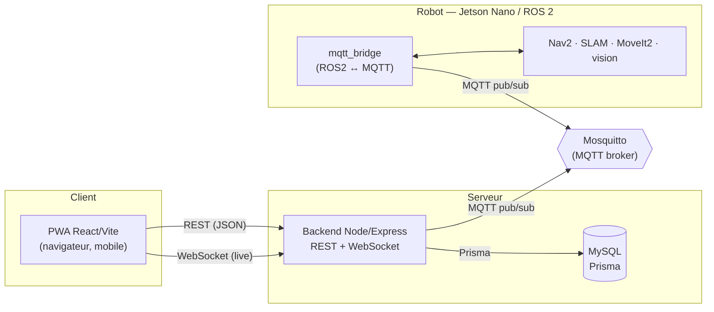

# Architecture — RobLaude

> Vue d'ensemble du système : navigateur ↔ backend ↔ (MySQL, Mosquitto) ↔ robot ROS 2.
> Le détail du contrat MQTT est dans [mqtt-spec.md](mqtt-spec.md), les endpoints
> dans [API.md](API.md).

## Schéma

## Composants

- **Frontend (PWA)** — React + Vite + TypeScript. Consomme le backend en REST
  pour les actions (missions, points, objets…) et en WebSocket pour le live
  (position, statut, progression de mission, carte SLAM). Ne parle **jamais**
  MQTT ni ROS directement.
- **Backend (Node/Express)** — autorité du système : auth (JWT), base de données
  (Prisma + MySQL), logique des missions. Pont entre le web et le robot : il
  publie les commandes et consomme la télémétrie via MQTT, qu'il relaie au
  frontend par WebSocket.
- **MySQL** — utilisateurs, robots, points, objets, missions, sessions de mapping,
  snapshots, annotations, audit SSH.
- **Mosquitto** — unique canal entre le serveur et le robot. Robot et backend se
  connectent **en sortie** ; aucun port entrant côté robot.
- **Robot (ROS 2 Humble)** — navigation (Nav2 + SLAM), bras (MoveIt2), vision
  (OpenCV). Un nœud `mqtt_bridge` traduit ROS 2 ↔ MQTT.

## Flux

- **REST (front → back)** — actions ponctuelles : login, CRUD, création/annulation
  de mission. Voir [API.md](API.md).
- **WebSocket (back → front)** — temps réel : le backend relaie au navigateur les
  événements reçus du robot (position, statut, sous-états de mission, carte).
- **MQTT (back ↔ robot)** — commandes (`cmd/*`), télémétrie (`telemetry/*`),
  cycle de mission (`mission/ack|status|result`), présence. Topics par robot
  (`roblaude/{robotId}/…`), QoS adaptés. Voir [mqtt-spec.md](mqtt-spec.md).

## Déploiement

- **Frontend** — Vercel (build statique PWA).
- **Backend** — Render (`prisma migrate deploy` au release, puis `node dist`).
- **Infra locale** — `docker compose up -d` (MySQL + Mosquitto).
