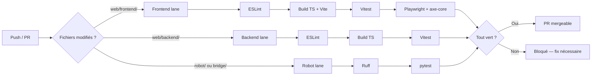

# Projection Pipeline CI/CD — RobLaude

## Principe général

À chaque push ou ouverture de PR, on veut s'assurer que le code est propre, compile, et ne casse rien. L'idée c'est de ne jamais laisser du code corrompu atteindre `dev` ou `main`. Un bug qui passe peut avoir un effet cascade sur le reste du projet.

La pipeline tourne sur github actions. On reste sur github pour tout (repo, issues, PR, CI), pas besoin d'aller chercher un outil externe quand tout est déjà au même endroit (plus simple et gratuit)
.

## Les 3 lanes

Le projet a 3 parties très différentes (frontend react, backend node, robot Python/ROS2). Les principes sont les mêmes partout : lint, build, test mais les outils changent selon le langage.

Chaque lane ne tourne que si des fichiers de sa partie ont changé. Pas besoin de lancer les tests robot quand on touche un composant react.

```
Push / PR
  ├── Frontend (web/frontend/)
  │     ESLint → TypeScript build → Vitest → Playwright
  │
  ├── Backend (web/backend/)
  │     ESLint → TypeScript build → Vitest
  │
  └── Robot (robot/ + bridge/)
        Ruff → pytest
```

### Frontend

| Étape | Outil | Ce que ça fait |
|-------|-------|----------------|
| Lint | ESLint | Vérifie le style et les erreurs de code |
| Build | `tsc` + `vite build` | Compile le TypeScript et génère le bundle de prod |
| Tests unitaires | Vitest | Teste les composants et la logique isolément |
| Tests E2E + accessibilité | Playwright + axe-core | Simule un vrai utilisateur sur l'app + audit WCAG AA |

### Backend

| Étape | Outil | Ce que ça fait |
|-------|-------|----------------|
| Lint | ESLint | Même chose que le front |
| Build | `tsc` | Compile le TypeScript |
| Tests unitaires | Vitest | Teste les routes, services, logique métier |

### Robot

| Étape | Outil | Ce que ça fait |
|-------|-------|----------------|
| Lint | Ruff | Linter Python rapide |
| Tests | pytest | Teste les noeuds ROS2 et la logique de navigation/manipulation |

## Enchaînement



## Pourquoi ces outils et pas d'autres

### GitHub Actions plutôt que Jenkins / GitLab CI

Notre repo est sur GitHub, nos issues sont sur GitHub, nos PR sont sur GitHub. GitHub Actions s'intègre directement avec tout ça, les checks apparaissent sur la PR, on peut bloquer le merge si c'est rouge. Jenkins demanderait un serveur à héberger et maintenir. GitLab CI demanderait de migrer le repo, donc c'est juste la solution la plus simple sans sacrifier la qualité.

### Vitest plutôt que Jest

Vitest est natif à Vite, il partage la même config, le même pipeline de transformation. Avec Jest il faudrait configurer Babel et le support TypeScript séparément. Vu qu'on utilise déjà Vite pour le build, c'est le choix logique.

### Playwright plutôt que Cypress

Playwright a l'intégration axe-core en natif pour les audits d'accessibilité. Notre cible principale c'est les personnes à mobilité réduite, la conformité WCAG AA est donc un must. Cypress peut le faire avec des plugins mais ce n'est pas intégré de base. Ptit bonus, Playwright tourne en headless par défaut, ce qui est mieux pour la CI.

### Ruff plutôt que Pylint / Flake8

Ruff est beaucoup plus rapide et remplace Flake8 + isort + une partie de Pylint en un seul outil. Moins de config, mêmes résultats.

## Ce qu'on ne fait pas (pour l'instant)

CD (déploiement automatique) : le frontend et le backend tournent en local pour le développement, le robot tourne en simulation Gazebo. Il n'y a pas de serveur de prod à déployer. Si on devait le faire, on utiliserait probablement docker + un VPS, avec un deploy déclenché quand `main` est mis à jour. Mais pour un projet académique avec démo en local, c'est hors scope.

Monitoring : pas de prod = pas de monitoring. En revanche, les logs Gazebo et les topics ROS2 servent de monitoring pendant le développement robot.
